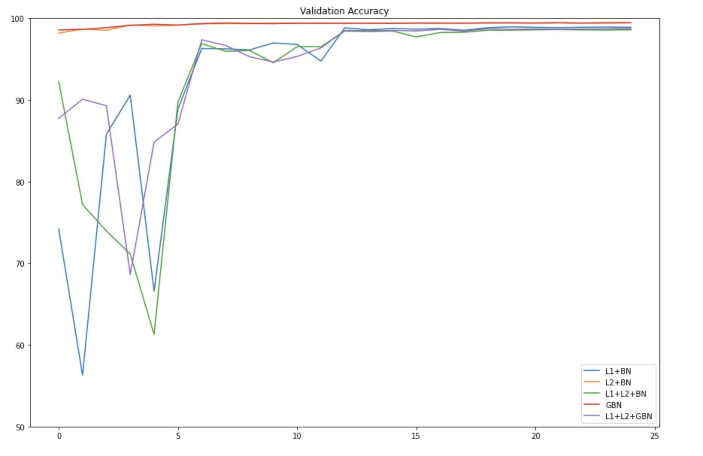

# Assignment 6

#### Done by:
1. Shashank Pathak (shashankhalo7@gmail.com)
2. Divyam Malay Shah (divyam096@gmail.com)
3. Arun Kumar (arun.rvbe@gmail.com)

### Files:
1. [assignment6.ipynb](https://github.com/divyam96/TheSchoolOfAI-EVA5-Assignments/blob/master/Assignment%206/assignment6.ipynb) --> Code 5 along with L1/L2 regularisation  and Ghost Batch Norm(GBN)
2. [Code5.ipynb](https://github.com/divyam96/TheSchoolOfAI-EVA5-Assignments/blob/master/Assignment%206/Code5.ipynb) --> Best code from the last assignment

### Assignment:
1. Use L1 and L2 regularization, and run bellow versions for 25 epochs and report findings:
   * L1 + BN
   * L2 + BN
   * L1 and L2 with BN
   * GBN
   * L1 and L2 with GBN

2. Implement a training loop that can automatically go through and train 5 models based on the above conditions for Code5.ipynb and for all the experiments plot the train and validation loss and accuracies.
3. Add Group Batch Normalisation to Code5 model.
4. Plot 25 Misclassified images for the trained GBN model.

### Results:
#### 1. Training Accuracy Plot

#### 2. Validation Accuracy Plot

#### 3. Training Losses Plot

#### 4. Validation Losses Plot

#### 5. Misclassified Images for Model with GBN

### Insights:
1) A plain model with BatchNorm and data augmentations(RandomRotation and ColorJitter) outperforms all the five regularization approaches. 
2) Among all regularizations, the model performs best with GBN based regularization both in terms of accuracy and stability(consistent loss across epochs).
3) L2+BN performs reasonably but none of the L1+L2 combinations(L1+L2+BN and L1+L2+GBN) give a good performance.
4) Some of the images misclassified by the GBN model are genuinely challenging and can be misclassified by humans too!
 
