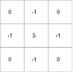
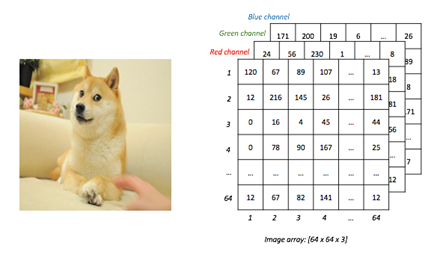
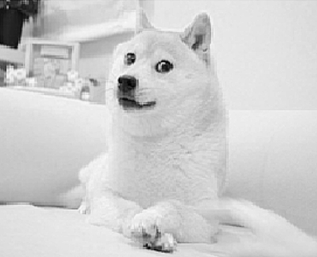
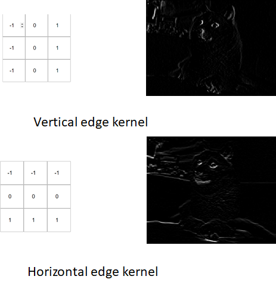
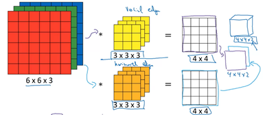
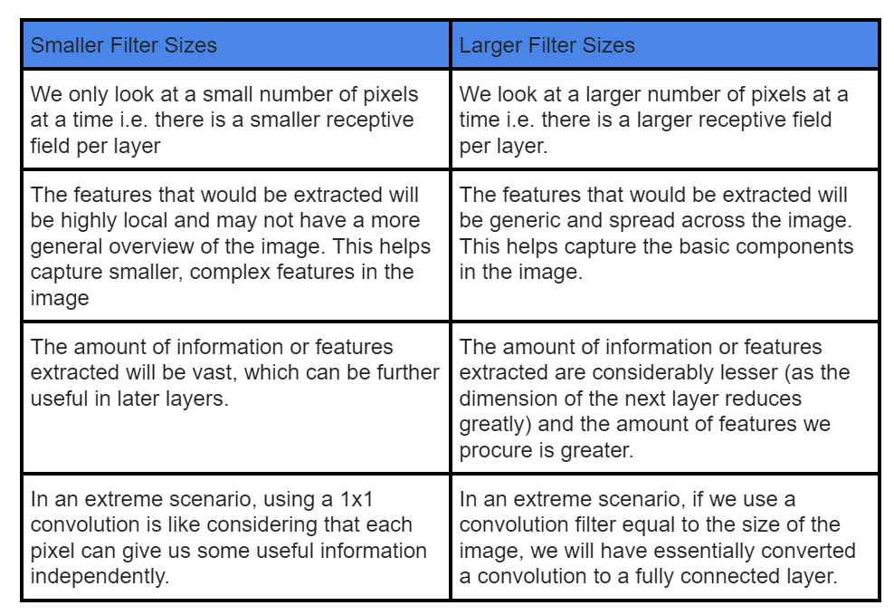
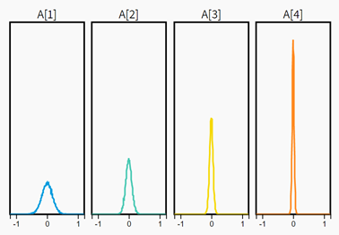
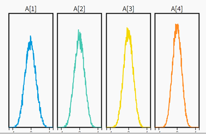

EVA5 Assignment 1
Group Members:
1) Divyam Malay Shah (divyam096@gmail.com)
2) Arun Kumar (arun.rvbe@gmail.com)
3) Shashank Pathak (shashankhalo7@gmail.com)
## 1. What are Channels and Kernels (according to EVA)? 
**Kernels**<br/>
Kernels are feature extractors. Mathematically a kernel is a matrix of weights<br/>
<br/>
(A sample 3x3 kernel that can be used to sharpen an image)<br/>
***How does the kernel extract features?***
- A kernel slides over the input data, performing an element-wise multiplication with the part of the input it is currently on, and then summing up the results into a single output pixel.
- The kernel repeats this process for every location it slides over and extracts the feature.<br/>
- 
***Feature extraction using kernels can be explained as follows:***
    1. Image is converted into an image matrix
    2. A kernel of the desired dimension is taken, here 3x3
    3. Multiply the kernel with the image matrix
    4. Extracted feature maps form the output at the given layer.
     
1. Any image can be represented as a 3 channel Image array, shown below. Each Image array’s value represents the intensity of the image pixel.<br/>

2. A kernel with the below weights will result in the sharpening of the image,<br/>
 
3. Pixel-wise multiplication of the above kernel with the input image array,<br/>
 
4. The output is the sharpened image<br/>
<br/>
Similarly, by taking different kernel weights different features can be extracted. Few below, <br/>
			

**Channels**<br/>
Every input can be represented as a set of channels. Here each channel defines a concept within the input data(Ex R, G, B are three channels in an input image). Each feature extracted by the kernel after the first layer of a CNN leads to the formation of a new Channel. This is also called a feature map<br/>

<br/>
Input image convolved with kernels to extract features. These features are Channels
 
- For an RGB image (3 channel – Red, Green, Blue). 3x3 Kernel should have a third dimension that matches the number of input channels.  In general, this is called a filter.  In the image above, 3x3x3 forms one filter
- Each filter happens to be a collection of kernels, with there being one kernel for every single input channel. 
- Each filter processes the input with its own, different set of kernels, and a scalar bias with the process described above, producing a single output channel.
- In the image above, two filters produce two 4x4 outputs. These are the Channels
- Number of filters = Number of output channels.
  
## 2. Why should we (nearly) always use 3x3 kernels? 
	 
Before we try to answer this question, we need to understand how kernel size impacts a Convolutional Neural Network(CNN). 
 
To evaluate the impact of the kernel size let us first understand **Receptive fields**:
 
In the context of CNNs, the **receptive field** is defined as the region in the input space that a particular CNN’s feature is looking at (i.e. be affected by).
 
Let us consider the following example(as shown in the figure) of an input image(purple) of size 5x5.
<ol> 
<li>We apply a kernel of size 3x3 on this image to get the first output layer(Yellow) of size 3x3.</li> 
<li>We apply the 3x3 kernel again to get our final output layer(green) of size 1x1.</li>
</ol> 

<br/> 

<ul>
<li>In the above example, the receptive field of each cell in the yellow layer is 3 as each cell on the yellow layer is influenced by a region of 3x3 from the input image.</li>
<li>Similarly, the receptive field of the final layer(green) is 5 as the cell in the green layer is indirectly(via yellow layer) able to reach the whole 5x5 region of the input image.</li> 
</ul>
	
We could have also used a 5x5 kernel to directly reach the output with a single convolution. But here the kernel would require 5x5=25 weights making computation more expensive. By using a 3x3 kernel twice we made use of (3x3 + 3x3) = 18 weights. This makes  3x3 kernels cheaper computationally. But this also leads to an extra layer as compared to the 5x5 kernel case making the 5x5  kernel more memory efficient during backpropagation. 
 
*Let us generalize how small filters are different from large filters:*
 
<br/> 
 
From the above table, it is clear that small kernel sizes over multiple layers help us extract more fine-grained information and lead to greater computational efficiency. This makes us prefer small kernel sizes over larger ones.
 
*So, are 1x1 kernels ideal?*</br>
No. 1x1 kernels view each pixel independently and do not enable us to capture relationships with neighboring pixels.
 
*Are 2x2 kernels ideal?*</br>
No. We tend to prefer filters with odd dimensions(3,5,7..etc) because if we were to consider the final output pixel (of the next layer) that was obtained by convolving on the previous layer pixels, all the previous layer pixels would be symmetrically around the output pixel. Without this symmetry, we will have to account for distortions across the layers. This is what happens with kernels having even dimensions. Therefore, even-sized kernel filters are not preferred. This eliminates 2x2 kernels. 
 
**Therefore, the choice of 3x3 kernels is a consequence of the following:**</br>
<ol>
<li>Preference of small kernel sizes due to their ability to extract more fine-grained details from images at greater computational efficiency.</li>
<li>Preference of odd-dimensional filters.</li>
<li>Rejection of 1x1 filter due to its inability to capture relations between neighbouring pixels of an image.</li>
</ol> 
 
 
## 3. How many times to we need to perform 3x3 convolutions operations to reach close to 1x1 from 199x199 (type each layer output like 199x199 > 197x197...)
 
```
199x199 > 197x197 > 195x195 > 193x193 > 191x191 > 189x189 > 187x187 > 185x185 > 183x183 > 181x181 > 179x179 > 177x177 > 175x175 > 173x173 > 171x171 > 169x169 > 167x167	> 165x165 > 163x163 > 161x161 > 159x159 > 157x157 > 155x155 > 153x153 > 151x151 > 149x149 > 147x147 > 145x145 > 143x143 > 141x141 > 139x139 > 137x137 > 135x135 > 133x133 > 131x131 > 129x129 > 127x127 > 125x125 > 123x123 > 121x121 > 119x119 > 117x117 > 115x115 > 113x113 > 111x111 > 109x109 > 107x107 > 105x105 > 103x103 > 101x101 > 99x99 > 97x97 > 95x95 > 93x93 > 91x91 > 89x89 > 87x87 > 85x85 > 83x83 > 81x81 > 79x79 > 77x77 > 75x75 > 73x73 > 71x71 > 69x69 > 67x67 > 65x65 > 63x63 > 61x61 > 59x59 > 57x57 > 55x55 > 53x53 > 51x51 > 49x49 > 47x47 > 45x45 > 43x43 > 41x41 > 39x39 > 37x37 > 35x35 > 33x33 > 31x31 > 29x29 > 27x27 > 25x25 > 23x23 > 21x21 > 19x19 > 17x17 > 15x15 > 13x13 > 11x11 > 9x9 > 7x7 > 5x5 > 3x3 > 1x1
```


## 4. How are kernels initialized? 
 Before we look at different ways of kernel initialization, let’s understand the criticality of initialization,<br/>
> “… if you are sloppy with the weight initialization, these non-linearities can “saturate” and entirely stop learning — your training loss will be flat and refuse to go down” – Andrej Karpathy <br/>

**Why Initialize Weights** <br/>
The aim of weight initialization is to prevent layer activation outputs from exploding or vanishing during the course of a forward pass through a deep neural network. If either occurs, loss gradients will either be too large or too small to flow backwards beneficially, and the network will take longer to converge if it is even able to do so at all. 

Generally, there are four ways to initialize the weights of the kernels before we start training our neural network.
  1. Zero initialization
  2. Random initialization
  3. Xavier Initialization
  4. He-et-al initialization<br/>

**How to find the appropriate initialization strategy among the above options?**<br/> 
Any initialization that prevents the gradients of the network’s activations from vanishing or exploding, is the desirable initialization. The below conditions should satisfy, 
1. The mean of the activations should be zero. High magnitudes will cause an explosion in gradients. 
2. The variance of the activations should stay the same across every layer. This will enable good gradient flow.

**1. Zero Initialization** <br/>
Set all the kernel weights to zero. In this case, all the kernels will output the same feature and no further learning happens. This is as good as having a single kernel extracting one feature. Therefore Zero Initialization is useless. <br/>

**2. Random Initialization** <br/>
The kernel weights are initialized very close to zero, but randomly. <br/>
>W = np.random.randn(layer_size(l), layer_size(l-1))*0.01<br/>

This works for small networks but can lead to non-homogeneous distributions of activations across the layers of the network. <br/>
To understand what this means, consider a 4 layer network, the below shows the histograms of activations of across layers,<br/>
 <br/>

In this distribution, as we proceed from layer 1 to layer 4, the variance/standard deviation gradually decreases. This is not desirable as mentioned in the appropriate initialization strategy <br/>

**3. Xavier Initialization** <br/>
The kernel weights are initialized keeping in mind the size of the previous layer. The weights are still random but differ in range depending on the size of the previous layer of neurons<br/> 
> W=np.random.randn(layer_size[l], layer_size[l-1]) * np.sqrt (1 / layer_size[l-1] )

<br/>
Looking at the distributions across layers, mean is zero and the variance/standard deviation is uniform across all the layers. 

**4. He-et-al initialization** <br/>
This method of initializing became famous through a paper submitted in 2015 by He et al, and is similar to Xavier initialization, with the factor multiplied by two. This helps in attaining a global minimum of the cost function faster and more efficiently<br/> 
> W=np.random.randn(layer_size[l],layer_size[l-1])*np.sqrt(2/layer_size[l-1])


## 5. What happens during the training of a DNN?

To understand what happens during training a Deep Neural network we should first understand what a deep neural network is made of and how it works. By understanding what happens during the training process of a neural network we are essentially trying to understand how a neural network learns.


At its core, a neural network is just a function that when given an input(a number or a collection of numbers) spits out an output(number or a  collection of numbers). The task of the neural net or this function is to understand the underlying pattern within the data.

Throughout these years there have been multiple variations that have been introduced to capture different types of patterns and complexities from different types of data. For our understanding, we will take the example of the simplest feed-forward neural network also known as a multi-layer perceptron or MLP for short. We will later extend our understanding to a Convolution Neural Network or CNN which is a special type of Neural Network most widely used to capture patterns in image data(spatial relation).


Structurally a deep neural network can be broken down into 3 main components; an input layer, output layer, and a bunch of hidden layers. Input layers are where the input gets fed to the neural network (pixel data values for image data). Hidden Layer extracts the relevant patterns from the data. Output layer spits out the predictions. For example, if it’s a classification task output is the predicted class. 
If you see a neural network you will realize that there's an inherent layered structure which helps the model learn different abstractions at different layers. The idea is similar to breaking a complex problem into much smaller problems and tackling one problem at a time(or for us tackling one at a layer).


For instance, identifying the number 9 can be broken down into identifying the upper circle and a vertical line below it. The circle further can be broken down into multiple arcs which can be broken down into small straight segments or lines. Similarly, the vertical line can be broken down into smaller line segments or edges.


Similarly, all complex patterns can be broken down into such levels of abstractions and the task then becomes to learn these lower-level abstractions such as edges/gradients and use them to build upon higher levels of abstractions such as texture, shapes and eventually objects.


One may now say that "So how does the neural network identify these patterns or concepts or features? ". The short answer is Parameters. Let’s understand this with the help of an example. In a neural network, all the neurons are looking for a specific pattern and when it finds this pattern it “fires up” or in simple words outputs a large number. Every neuron in a layer is dependent on the neurons in the preceding layer with the help of connections. Let’s assume that the neuron gives some weightage to each and every connection. So to make its decision a neuron takes a weighted sum of the values it sees in the previous layers. Also, it might need some threshold to make the decision, i.e. if the value is above a particular threshold it fires up otherwise it stays inactive. Let’s call this threshold a “bias”. This kind of behaviour is analogous to how neurons in the brain fire up when they sense some particular pattern. So in order to find an edge on a particular location in the image, the corresponding weights should be “high” and other neighbouring weights should be “low”. 


So during training, the neural network learns these parameters. 


The training process consists of the following steps
1. Start with some random parameters
2. Take an instance from the input data and pass it through the network to obtain the model's prediction.
3. We compare the prediction obtained with the expected value and calculate the loss
4. Now to minimize this loss we use the gradient descent algorithm. For that, we calculate the gradient of the loss w.r.t. all the parameters.
5. We then use this gradient to update the parameters of the neural network in a way that the total loss is reduced and a better model is obtained.
6. We repeat steps 2 - 5  until the loss is minimised to a value that is satisfactory. 


