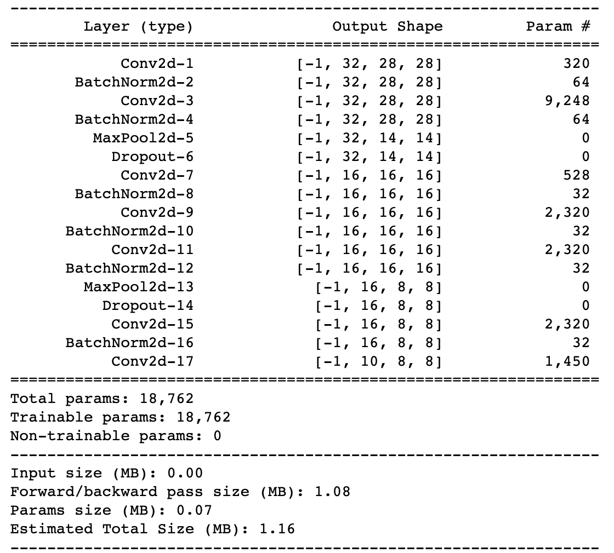

# EVA5 Assignment 4
### Shashank Pathak

The task was to create a train a CNN network that can classify MNIST data with the following constraints:
* 99.4% validation accuracy
* Less than 20k Parameters
* You can use anything from above you want. 
* Less than 20 Epochs
* No fully connected layer
 

## Final Model 

## Parameters
**18,762**

## Best Test Accuracy

## Approach
In the base network there were around 6.3 million parameters and after training it for 19 epochs it got around 99.25%

In order to train a model with less than 20k parameters and satify the above constraints I did the following changes

* **Batch Normalization** : Adding batch normaliztion layer after every convolution layer.
* **Drop Out** : Dropout layer adds a regularizing effect. It would have been beeter if Cutout was used as dropout is mostly for 1d data. Used it only twice.After the maxpool layers. There was no logic in that, it was more of a performance based decision(Got more accuracy after maxpool layers).
* **1x1 Convolutions** : Used 1x1 Counvolution layer twice after Maxpooling layers to reduce channels, combine and mix channel inforamtion and reduce load over subsequent 3x3 convolutions
* **GAP** : Used global average pooling after channel size reached 7x7 to flatten the 2d channels. Didn't use FC layers. 
* **Remove ReLU before the last layer** : ReLU, Maxpooling and Dropout should not be present before the last layer(log_softmax)
* **Kernels** : Started from 16 went till 32 then used 1X1 to reduce channels. After that kept the kernel count to 16 to reduce the parameter count. As the problem was relatively simpler, as inter class variation was significant(variantion between the number (0,1,2,..9)) and intra class variation was low (inside a class i.e variations of 1's or 2's) this problem can be solved with relatively lesser number of kernels.

    
